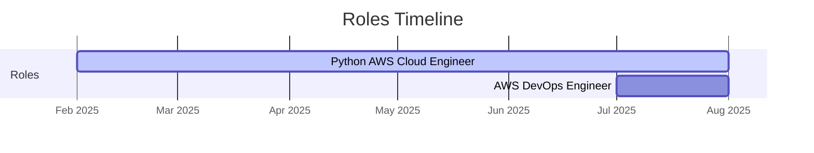

<!--
**zoeyalex/zoeyalex** is a ✨ _special_ ✨ repository because its `README.md` (this file) appears on your GitHub profile.

Here are some ideas to get you started:

- 🔭 I’m currently working on ...
- 🌱 I’m currently learning ...
- 👯 I’m looking to collaborate on ...
- 🤔 I’m looking for help with ...
- 💬 Ask me about ...
- 📫 How to reach me: ...
- 😄 Pronouns: ...
- ⚡ Fun fact: ...
-->
# 👷‍♀️😸zcat
<!--

-->
<pre>
Roles
├── Python AWS Cloud Engineer   <i>2025-02</i> to <i>08</i>
└── AWS DevOps Engineer         <i>current</i>
</pre>

likes
-

 - GNU/Linux,
 - FLOSS/FOSS/KISS
 - declarative/functional programming, 
 - backend development,
 - design patterns,
 - writing maintainable code 
 - designing modular architectures with reusable components.

tech:
-
**`Cloud`** AWS (EC2, ECS, EKS, S3, Lambda, ApiGateway, Cloudwatch, IAM, DynamoDB, etc.)

**`DB`** SQL, MSSQL, Oracle Database (PL/SQL), ORDS, Oracle APEX (REST based PL/SQL API), DynamoDB (NoSQL - key/val)

**`Langs`** Python, C/C++, Scheme(Lisp), Bash, YAML, XML

**`DevOps`** Terraform, Docker, Jenkins, Kubernetes, GitHub Actions

**`Etc`** Git, GNU/Linux, Vim, VSCodium

